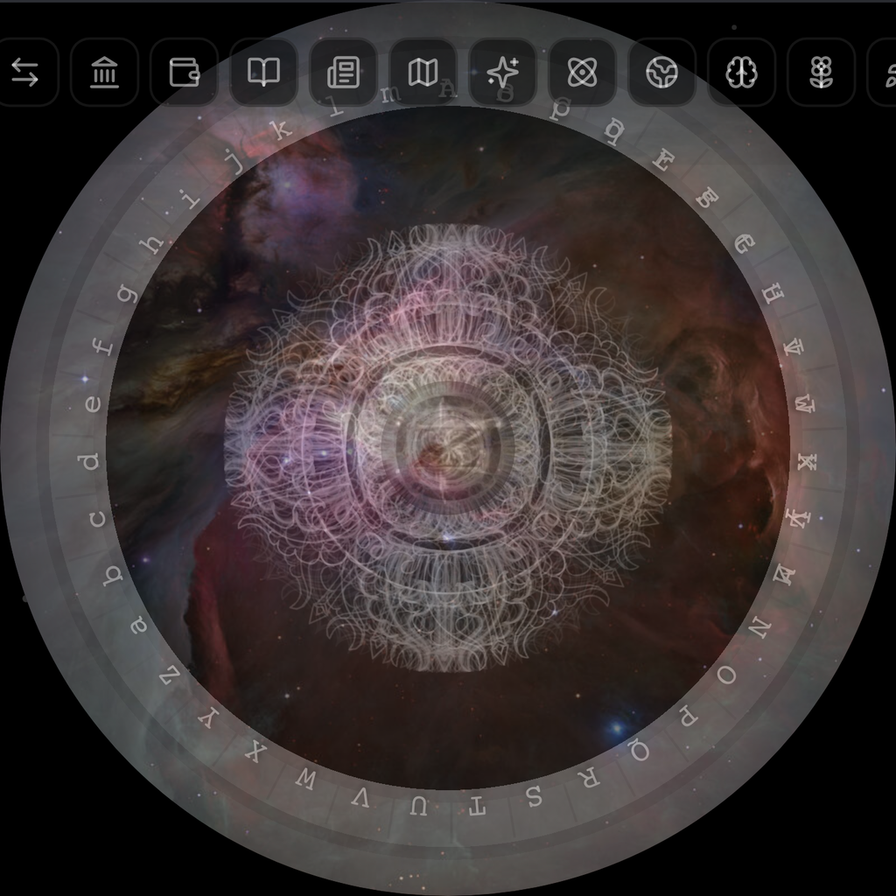

<div align="center">

<!-- Hero banner — Stargate OG image -->


<!-- Title -->
<h1>ZION</h1>

<h3>Terra Nova — 100 years of evoluZion</h3>

<p><em>Mine ZION. Enter the OASIS. Find the Golden Egg.</em></p>

<!-- Badges -->
<p>


</p>

<!-- Links -->
<p>

[🌐 Hub](https://zionterranova.com)
&nbsp;·&nbsp;
[📊 Explorer & dApp](https://app.zionterranova.com)
&nbsp;·&nbsp;
[🎮 Oasis Web](https://oasis.zionterranova.com)
&nbsp;·&nbsp;
[📖 Whitepaper](./docs/whitepaper.md)
&nbsp;·&nbsp;
[🏗️ OASIS Build Journal](./docs/OASIS_DEVLOG.md)
&nbsp;·&nbsp;
[⚡ CLI](./V3/cli/README.md)
&nbsp;·&nbsp;
[🔒 Security](./SECURITY.md)

</p>

</div>

---

<div align="center">

## The Four Layers

</div>

| Layer | Name | What it does |
|:-----:|:----:|:-------------|
| **L1** | **Core** | PoW blockchain — the foundation. Custom algorithm `deeksha_lite_v1`, 60s blocks, CPU + GPU mining. |
| **L2** | **DeFi** | Staking, farming, governance, cross-chain bridge to 6 EVM chains (Base, Arbitrum, BSC, Polygon, Optimism, Avalanche). |
| **L3** | **WARP** | Cross-chain router — 21 registered chain adapters, atomic swaps, Hiran AI inference layer. |
| **L4** | **Oasis** | Consciousness-mining spiritual MMORPG — 199 avatars, 245 quests, the Golden Egg (108 clues), 1B ZION prize pool. |

<div align="center">

*ZION is a multi-layer blockchain: L1 PoW core, L2 DeFi and cross-chain bridge, L3 WARP and Hiran AI, and L4 Oasis — a consciousness-mining spiritual MMORPG.*

*This repository contains the v3 mainnet codebase. It is currently in **Mainnet Beta**: live, producing blocks, and open for mining at your own risk.*

</div>

---

<div align="center">

## Enter the Ecosystem

</div>

ZION's web presence is organised across three domains:

| Portal | URL | What's there |
|:------:|:----|:-------------|
| 🌐 **Hub** | [zionterranova.com](https://zionterranova.com) | The front door — an overview of the entire ZION multichain ecosystem and a portal into everything below. |
| 📊 **Explorer & dApp** | [app.zionterranova.com](https://app.zionterranova.com) | Full web application — block explorer, wallet, DeFi dashboard, ZionDex, bridge, governance, and all dApp functionality. |
| 🎮 **Oasis Web** | [oasis.zionterranova.com](https://oasis.zionterranova.com) | The OASIS 3D galaxy — fly through 55 worlds, explore warp-gate networks, and enter individual worlds in your browser. |

---

<div align="center">

## Get Started

</div>

| Path | How |
|:------:|:-----|
| ⛏️ **Mine (desktop)** | Download a ready-to-use binary and start in minutes. See the [Desktop Miner Quick Start](#desktop-miner-quick-start) below. |
| ⛏️ **Mine (SMOS/HiveOS)** | Run the miner on mining OS rigs. See [`docs/SMOS_HIVEOS_GUIDE.md`](./docs/SMOS_HIVEOS_GUIDE.md). |
| ⛏️ **Mine (build from source)** | Build the node, CLI, and miner from source. Start with [`V3/cli/README.md`](./V3/cli/README.md). |
| 🎮 **Play** | Enter the L4 Oasis world — avatars, quests, guilds, and the Golden Egg. See [`docs/OASIS_DEVLOG.md`](./docs/OASIS_DEVLOG.md) and [`V3/L4/oasis/README.md`](./V3/L4/oasis/README.md). |
| 🔨 **Build** | Explore the codebase, contracts, RPC, and bridge docs in [`V3/docs/`](./V3/docs/) and [`docs/`](./docs/). |
| ❓ **FAQ** | Common questions for beginners and rig operators. See [`docs/FAQ.md`](./docs/FAQ.md). |

---

<div align="center">

## Network Status

</div>

> **⚠️ Mainnet Beta — live at your own risk**

| Parameter | Value |
|:----------|:------|
| **Status** | Mainnet Stable |
| **Protocol** | 3.1.0 "Boost" |
| **Genesis hash** | `96109423298542a836edc10b9ba5ff9b29a1970418db543c2ee5cd952fe35bdb` |
| **Official launch** | postponed (TBD) |
| **Block time** | ~60 seconds |
| **Mining algorithm** | `deeksha_lite_v1` (CPU + GPU) |
| **Total supply** | 144B ZION |
| **Premine** | 14 slots (founders, treasury, OASIS pool, liquidity) |

All disclosed security issues have been remediated. See [Security](./SECURITY.md) and the [disclosure report](./docs/security/SECURITY_DISCLOSURE_2026-07.md).

---

## Boost Streams — Three Streams of One River

> **Mine ZION. Earn ZION. Grow ZION.**

Starting with v3.0.6-beta, the official ZION miner carries a new
capability — a bonus for everyone who mines: **Boost Streams**.

Boost Streams is a smart mining engine built directly into the official miner.
It activates automatically — no configuration, no second wallet, no
second application. It does one thing: **extract more value from your
hardware than the core alone could, and pay all of it out in ZION.**

### How it works — in plain language

Your machine has a GPU and a CPU. In traditional mining, only one of
them does useful work at a time — the other sits idle or mines a
different coin that you then have to sell.

Boost Streams runs **three streams simultaneously**:

| Stream | What it does | What you receive |
|:-------|:-------------|:-----------------|
| **Stream 1 — ZION core** | Mines ZION blocks using the Deeksha algorithm | ZION |
| **Boost Stream 1 (GPU)** | Uses spare GPU cycles to mine | ZION (auto-converted) |
| **Boost Stream 2 (CPU)** | Uses spare CPU cycles to mine | ZION (auto-converted) |

The engine internally distributes work so no cycle goes unused. All
revenue — from all three streams — arrives as a single balance in your
wallet: **ZION, growing.**

### Zion Grow — a position that compounds by itself

- Every block your hardware contributes to increases your balance.
- You never need to sell, swap, or watch an exchange.
- The longer you mine, the more ZION you hold — simply by leaving the
  miner running.

### Zion Liquidity — a river flowing the right way

The old mining pattern: mine a coin → sell it on an exchange → crush the
price → leave. The more people mine, the greater the sell pressure.

**Boost Streams inverts the pattern:**

- The engine internally converts all mined value into ZION before
  anything touches an exchange.
- The miner never needs to sell — they receive ZION directly.
- Mining therefore **creates no sell pressure**. On the contrary: with
  every hash, the liquidity depth of the whole network grows.

### A bonus, not a condition

Boost Streams demands nothing: it is not a fee, a registration, or a setting.
It is a property of the official ZION miner v3.0.6 and later. ZION's
core and pool remain fully open under the MIT license.

> For the full philosophical and technical context, see
> [**Part Four — Three Streams of One River**](./docs/WP/ZION_MASTER_WHITEPAPER_3.1_EN.md)
> in the Master Whitepaper.

---

## Desktop Miner Quick Start

> Don't want to build from source? Download a ready-made binary and start mining in 2 minutes.

ZION ships **two kinds** of pre-built miner binaries:

| Type | What it is | Release |
|:------|:-----------|:--------|
| **Desktop GUI Miner** (Boost Streams) | Electron + TUI app with full dashboard, hashrate graphs, Boost Stream cards, auto-updater. Recommended for most users. | [`v3.1.0-desktop`](https://github.com/Zion-TerraNova/v3-Mainnet/releases/tag/v3.1.0-desktop) |
| **CLI Miner** (headless) | Single `zion-miner` binary for servers, SMOS/HiveOS rigs, and scripting. | [`v3.1.0-boost`](https://github.com/Zion-TerraNova/v3-Mainnet/releases/tag/v3.1.0-boost) |

---

### Option A — Desktop GUI Miner (v3.1.0-desktop)

#### 1. Download for your system

| Your system | Download file | Size |
|:------------|:--------------|-----:|
| **Linux x86_64** (Ubuntu, Debian, SMOS, HiveOS) | [`zion-public-miner-v3.1.0-linux-x86_64.AppImage`](https://github.com/Zion-TerraNova/v3-Mainnet/releases/download/v3.1.0-desktop/zion-public-miner-v3.1.0-linux-x86_64.AppImage) | 138 MB |
| **Linux x86_64** (Debian/Ubuntu package) | [`zion-public-miner-v3.1.0-linux-amd64.deb`](https://github.com/Zion-TerraNova/v3-Mainnet/releases/download/v3.1.0-desktop/zion-public-miner-v3.1.0-linux-amd64.deb) | 111 MB |
| **Windows x86_64** (10/11) | `zion-public-miner-v3.1.0-windows-x86_64.exe` | 117 MB |
| **Windows x86_64** (portable ZIP) | `zion-public-miner-v3.1.0-windows-x86_64.zip` | 157 MB |
| **macOS Apple Silicon** (M1/M2/M3/M4) | `zion-public-miner-v3.1.0-macos-arm64.dmg` | 134 MB |

> Windows and macOS assets are published on the [v3.1.0-desktop release page](https://github.com/Zion-TerraNova/v3-Mainnet/releases/tag/v3.1.0-desktop).

#### 2. Install & run

**Linux — AppImage:**
```bash
chmod +x zion-public-miner-v3.1.0-linux-x86_64.AppImage
./zion-public-miner-v3.1.0-linux-x86_64.AppImage
```

**Linux — DEB:**
```bash
sudo dpkg -i zion-public-miner-v3.1.0-linux-amd64.deb
zion-public-miner   # or find "ZION Miner" in your app menu
```

**Windows:**
Double-click the `.exe` installer and follow the wizard, or extract the portable `.zip` and run `zion-public-miner.exe`.

**macOS:**
Open the `.dmg`, drag ZION Miner to Applications, then launch. On first run right-click → **Open** (Gatekeeper bypass for unsigned apps).

#### 3. First-run setup

The desktop miner opens a setup wizard that asks for:
- your ZION **wallet address** (`zion1...`)
- a **worker name** (e.g. `desktop-rig`)
- **GPU backend** (`auto`, `opencl`, `cuda`, `metal`, or `cpu`)
- number of **CPU threads**
- mining **profile** (`pool` is recommended)

Then it launches with Boost Streams enabled — ZION core + Boost Stream 1 (GPU) + Boost Stream 2 (CPU) all running simultaneously.

---

### Option B — CLI Miner (v3.1.0-boost, headless)

#### 1. Download for your system

| Your system | Download file |
|:------------|:--------------|
| **Linux x86_64** | `zion-miner-linux-x86_64.tar.gz` |
| **Linux ARM64** (Raspberry Pi 4/5, Ampere, Jetson) | `zion-miner-linux-aarch64.tar.gz` |
| **macOS Apple Silicon** (M1/M2/M3/M4) | `zion-miner-macos-aarch64.tar.gz` |
| **macOS Intel** (pre-2020 Macs) | `zion-miner-macos-x86_64.tar.gz` |
| **Windows x86_64** (10/11) | `zion-miner-windows-x86_64.zip` |

Latest CLI release: **[v3.1.0-boost](https://github.com/Zion-TerraNova/v3-Mainnet/releases/tag/v3.1.0-boost)**

#### 2. Extract

**Linux / macOS:**
```bash
tar xzf zion-miner-linux-x86_64.tar.gz   # replace with your file
chmod +x zion-miner start.sh
```

**Windows:**
Right-click the downloaded `.zip` → **Extract All**, then open the extracted folder.

#### 3. Run the interactive setup

**Linux / macOS:**
```bash
./zion-miner
```

**Windows:**
Double-click `zion-miner.exe` or run `zion-miner.exe` in Command Prompt.

The miner asks for:
- your ZION **wallet address** (`zion1...`)
- a **worker name** (e.g. `desktop-rig`)
- **GPU backend** (`auto`, `opencl`, `cuda`, `metal`, or `cpu`)
- number of **CPU threads**
- mining **algorithm**
- mining **profile** (`pool` is recommended)

Then it launches with the right settings.

#### 4. Advanced wrapper script (optional)

Use `start.sh` (Linux/macOS) or `start.bat` (Windows) for the same questions
plus extra pass-through arguments. Set `ZION_EASY_MENU=0` to skip prompts
and supply command-line arguments directly.

#### 5. Manual start (optional)

```bash
./zion-miner \
    --pool pool.zionterranova.com:8444 \
    --wallet zion1YOUR_WALLET_ADDRESS \
    --worker my-rig \
    --gpu auto \
    --algorithm deeksha_lite_v1 \
    --profile pool
```

On Windows use `zion-miner.exe` in Command Prompt or PowerShell.

---

### Which GPU backend should I choose?

| GPU | Backend | Notes |
|:----|:--------|:------|
| NVIDIA on Linux x86_64 | `auto` / `cuda` | Fastest |
| AMD / Intel on Linux x86_64 | `auto` / `opencl` | |
| Apple Silicon (M1-M4) | `auto` / `metal` | |
| Older Mac (Intel/AMD) | `opencl` / `cpu` | OpenCL may be limited on macOS |
| NVIDIA on Windows | `auto` / `cuda` | Windows build currently ships CUDA |
| AMD / Intel on Windows | `opencl` / `cpu` | OpenCL support is coming in a future release |
| No / unknown GPU | `cpu` | Slow but works everywhere |

### Need more help?
- **Full FAQ:** [`docs/FAQ.md`](./docs/FAQ.md)
- **SMOS / HiveOS rigs:** [`docs/SMOS_HIVEOS_GUIDE.md`](./docs/SMOS_HIVEOS_GUIDE.md)
- **Build from source:** continue below in "Begin Guide".

---

## Begin Guide — Start from zero

> Never used a blockchain before? You're in the right place.
> This guide walks you through everything step by step.
> All you need is a computer with Linux, macOS, or Windows (WSL).

### What is ZION in one paragraph?

ZION is a **proof-of-work blockchain** (like Bitcoin, but with a different mining algorithm). It has its own currency called **ZION**. You can **mine** ZION with your CPU or GPU, **send** it to others, and eventually **play** in the Oasis game world to earn more. The network is live right now — you can join it today.

### Step 0 — Install Rust

ZION is written in Rust. You need the Rust toolchain to build it.

```bash
# Linux / macOS / WSL — install Rust via rustup
curl --proto '=https' --tlsv1.2 -sSf https://sh.rustup.rs | sh
source ~/.cargo/env

# Verify it works
rustc --version
cargo --version
```

> **Windows users:** Pre-built Windows binaries are available on the [releases page](https://github.com/Zion-TerraNova/v3-Mainnet/releases) — see [Desktop Miner Quick Start](#desktop-miner-quick-start) above. To build from source on Windows, install [WSL2](https://learn.microsoft.com/en-us/windows/wsl/install) first, then run the commands above inside WSL.

### Step 1 — Get the code

```bash
git clone https://github.com/Zion-TerraNova/v3-Mainnet.git
cd v3-Mainnet/V3
```

### Step 2 — Build everything

This compiles the node, CLI, and miner. It takes 5–15 minutes the first time.

```bash
# Build all binaries (node + CLI + miner + pool + bridge + DAO + oasis)
cargo build --release

# The key binaries you'll use:
#   target/release/zion          — the CLI (wallet, mining, node control)
#   target/release/zion-node     — the blockchain node
#   target/release/zion-miner    — standalone miner
```

> **Want GPU mining?** Add a feature flag:
> - NVIDIA CUDA: `cargo build --release --features gpu-cuda -p zion-miner`
> - AMD / generic OpenCL: `cargo build --release --features gpu-opencl -p zion-miner`
> - Apple Silicon Metal: `cargo build --release --features gpu-metal -p zion-miner`

### Step 3 — Create your wallet

Your wallet holds your ZION. It's a JSON file protected by a password you choose.

```bash
# Generate a new wallet with a 24-word recovery phrase (mnemonic)
# WRITE DOWN the 24 words on paper and keep them safe — they are your only backup!
./target/release/zion wallet new --mnemonic --out my-wallet.json

# Check your wallet address (this is where mining rewards go)
./target/release/zion wallet info --wallet my-wallet.json
```

> **What is a wallet address?** It's like a bank account number but public — it starts with `zion1...` and you can share it freely. The 24-word mnemonic is your **private** key — never share it with anyone.

### Step 4 — Run a node (optional but recommended)

A node connects to the ZION network, downloads the blockchain, and verifies transactions. Running one helps keep the network decentralized.

```bash
# Start the node (it will sync the blockchain from other peers)
./target/release/zion-node

# In another terminal, check if it's working:
./target/release/zion node status
```

> **What is syncing?** The node downloads all blocks from the genesis block to the current tip. This can take a while on first run. After that, it stays up to date automatically.

### Step 5 — Start mining

Mining is how new ZION is created. Your computer solves math puzzles (proof-of-work), and when it finds a solution, you earn a block reward.

**Option A — the standalone desktop miner (recommended for most users):**
Download a pre-built binary from the [releases page](https://github.com/Zion-TerraNova/v3-Mainnet/releases) and run the included `start.sh` / `start.bat` menu. See the [Desktop Miner Quick Start](#desktop-miner-quick-start) above.

**Option B — build from source with the CLI:**
```bash
# The easiest way — run the onboarding wizard
./target/release/zion config init

# Or start mining directly with your wallet
./target/release/zion mine start --wallet my-wallet.json

# Check mining status
./target/release/zion mine status

# Stop mining
./target/release/zion mine stop
```

> **CPU vs GPU:** Mining with a CPU works but is slow. A GPU (graphics card) is much faster. Run `zion mine bench --gpu` or the standalone miner's `--profile benchmark` to test your GPU hashrate.
>
> **Pool vs Solo:** By default, both the CLI and the standalone miner connect to the official pool (`pool.zionterranova.com:8444`, which resolves to `62.171.141.136:8444`). In pool mode, you earn a share of every block the pool finds. In solo mode, you only earn when *you* find a block — which could take a long time. Pool mode is recommended for beginners.

### Step 6 — Check your balance and send ZION

```bash
# Check your balance
./target/release/zion wallet balance --wallet my-wallet.json

# Send ZION to someone
./target/release/zion wallet send --to zion1... --amount 1.5 --wallet my-wallet.json
```

### Interactive menu (easiest for beginners)

If you don't want to remember commands, just run:

```bash
./target/release/zion menu
```

This opens an interactive arrow-key menu with all options — wallet, node, mining, pool, and config.

### Glossary — key terms explained simply

| Term | What it means |
|------|--------------|
| **Blockchain** | A public ledger of all transactions, shared across many computers |
| **Node** | A computer running the ZION software that stores and verifies the blockchain |
| **Mining** | Using your computer's power to secure the network and earn ZION rewards |
| **Wallet** | A file that holds your private keys — it lets you send and receive ZION |
| **Mnemonic** | 24 words that can restore your wallet — write them down, never share them |
| **Block** | A group of transactions added to the chain every ~60 seconds |
| **Pool** | A group of miners working together — rewards are split among participants |
| **ZION** | The currency of this blockchain (ticker: ZION) |
| **Genesis block** | The very first block — the foundation of the entire chain |
| **Mainnet Beta** | The live network is running but may still have bugs — mine at your own risk |

### Need help?

- **Full documentation:** [README_FULL.md](./README_FULL.md)
- **CLI reference:** [`V3/cli/README.md`](./V3/cli/README.md) — every command explained
- **Node docs:** [`V3/docs/`](./V3/docs/) — architecture, constants, runbooks
- **Hub:** [zionterranova.com](https://zionterranova.com)
- **Explorer & dApp:** [app.zionterranova.com](https://app.zionterranova.com)
- **Oasis Web:** [oasis.zionterranova.com](https://oasis.zionterranova.com)
- **GitHub:** [Zion-TerraNova/v3-Mainnet](https://github.com/Zion-TerraNova/v3-Mainnet)
- **Issues:** [GitHub Issues](https://github.com/Zion-TerraNova/v3-Mainnet/issues)

---

<div align="center">

## Languages

</div>

| | | | | |
|:---:|:---:|:---:|:---:|:---:|
| **English** | [Čeština](./docs/lang/README.cs.md) | [Español](./docs/lang/README.es.md) | [Français](./docs/lang/README.fr.md) | [Português](./docs/lang/README.pt.md) |

---

<div align="center">

## Full Documentation

For a complete overview of architecture, features, history, and roadmap, see **[README_FULL.md](./README_FULL.md)**.

</div>

---

<div align="center">


## License

This project is licensed under the [MIT License](./LICENSE).

---

### Built with care, secured by consensus.

[🌐 Hub](https://zionterranova.com) · [📊 Explorer & dApp](https://app.zionterranova.com) · [🎮 Oasis Web](https://oasis.zionterranova.com) · [📦 GitHub](https://github.com/Zion-TerraNova/v3-Mainnet) · [🔒 Security](./SECURITY.md) · [📜 Whitepaper](./docs/whitepaper.md) · [⚖️ Legal](./docs/LEGAL_DISCLAIMER.md)

</div>
