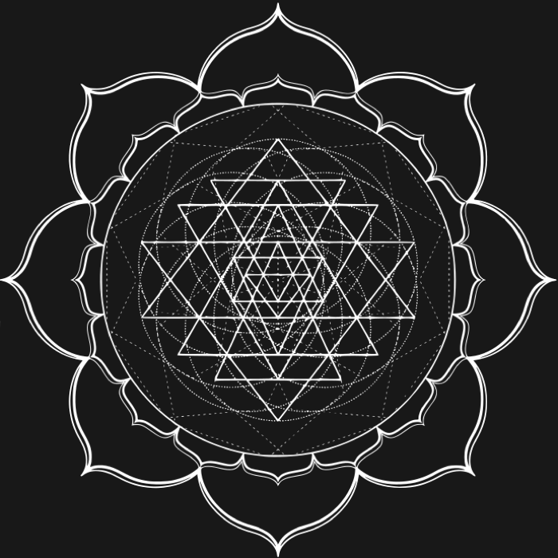

# ZION v3 — Mainnet Beta

<div align="center">

<!-- ════ STARGATE — Cosmic Portal ════ -->
<picture>
  <source media="(prefers-color-scheme: dark)" srcset="./docs/stargate/nebula.jpg">
  
</picture>

<br/>

**Multichain Dharma Ecosystem**

A proof-of-work blockchain with dual-algo consensus, cross-chain bridge, DeFi layer, and DAO governance.

[](https://opensource.org/licenses/MIT)
[](https://www.rust-lang.org/)
[](https://soliditylang.org/)
[](#network-status)

**English** · [Čeština](./docs/lang/README.cs.md) · [Español](./docs/lang/README.es.md) · [Français](./docs/lang/README.fr.md) · [Português](./docs/lang/README.pt.md)

</div>

<details>
<summary>🌌 <b>Enter the Stargate</b> — Interactive Portal</summary>

<div align="center">





<br/><br/>

> **The Stargate** is ZION's cosmic portal — a holographic gateway with 28 rotating layers (mandala + Sri Yantra), 39 glyphs (Stargate SG-1 addressing system), and 9 chevrons representing the 9 consciousness levels of the Oasis gaming world.
>
> The portal symbolizes the bridge between the physical blockchain (L1–L3) and the Oasis gaming metaverse (L4). On the live website ([zionterranova.com](https://zionterranova.com)), the Stargate is fully animated with CSS rotations and interactive hover effects.

<br/>

| Stargate Element | Symbolism |
|------------------|-----------|
| 28 rotating layers | Mandala + Sri Yantra sacred geometry |
| 39 glyphs (A–Z, a–m) | Stargate SG-1 addressing system |
| 9 chevrons (cyan glow) | 9 consciousness levels (Kabbalah Sefirot) |
| Center Z logo | ZION — the seed of consciousness |
| Nebula background | Hubble deep-space imagery |

</div>

</details>

---

## Network Status

> **⚠️ MAINNET BETA — Mining at your own risk**

ZION v3.0.5 is **live and running** as Mainnet Beta. The network is operational, blocks are being produced, and the genesis chain is established.

**What this means:**
- ✅ The network is live and producing blocks
- ✅ Genesis block and chain history are **permanent** — they will not be reset
- ✅ All disclosed vulnerabilities (F1–F5, C1–C8) have been remediated
- ✅ All 7 DeFi contracts verified on Basescan
- ⚠️ The network may still contain bugs — mine and transact at your own risk
- ⚠️ No warranty is provided — see [Legal Disclaimer](./docs/LEGAL_DISCLAIMER.md)

**Official Public Launch: December 31, 2026**

The Mainnet Beta period runs until the official public launch on **31.12.2026**, per the original roadmap. During this period:
- The network undergoes continuous security verification
- If the network passes security verification, the genesis block and all mined blocks **will remain permanently**
- Community feedback and bug reports are welcome — see [Contributing](./CONTRIBUTING.md)
- Mining rewards are real and non-reversible

| Parameter | Value |
|-----------|-------|
| Status | **Mainnet Beta** |
| Protocol | 3.0.6 |
| Genesis hash | `4f75a0dfe6dde3b167287d445aa1ade56577b0e9166c641ed288b4c20a79bd6e` |
| Official launch | 2026-12-31 |
| Mining | Active (at your own risk) |

---

## Overview

ZION is a multi-layer blockchain infrastructure built on proof-of-work consensus with a dual-algorithm design (Ekam Deeksha). The v3 mainnet features:

- **L1 Consensus** — Rust-based PoW node with Ed25519 signatures, BLAKE3 hashing, LWMA difficulty adjustment, UTXO + account transaction models, and P2P networking
- **L2 DeFi** — Smart contracts on Base Mainnet (Governance, Treasury, Staking, Farm) + cross-chain bridge relay + atomic swap + DAO governance
- **L2 Bridge** — ZION L1 ↔ EVM bridge with validator quorum (5/5 threshold), deployed on 6 EVM chains
- **L3 WARP** — Cross-chain protocol with 12 chain adapters registered (EVM, Solana, Aptos, Sui, Cardano, TON, etc.; 11 fully functional, TON currently watch-only)
- **L3 Hiran** — AI-native agent framework (Hiranyagarbha) with multi-modal language model, Dharma validator, and consciousness engine
- **L4 Oasis** — AAA spiritual MMORPG: consciousness mining game with 199 sacred avatars, 9 consciousness levels, guild warfare, and the Golden Egg treasure hunt
- **L5 Community** — Free-world community layer with sefirot governance vows
- **L6 Issobella** — Guardian layer for humanitarian and cultural missions
- **Stargate** — Official ZION logo and cosmic portal: holographic gateway symbolizing the bridge between blockchain and the Oasis gaming metaverse
- **RPC** — JSON-RPC 2.0 with 17+ node methods, Prometheus metrics, health checks

## Architecture

```
┌─────────────────────────────────────────────────┐
│                    L1 Core                       │
│  ┌──────────┐  ┌──────────┐  ┌───────────────┐  │
│  │ Consensus │  │   P2P    │  │  JSON-RPC     │  │
│  │  (PoW)    │  │ Network  │  │  + Metrics    │  │
│  └──────────┘  └──────────┘  └───────────────┘  │
│  ┌──────────┐  ┌──────────┐  ┌───────────────┐  │
│  │  UTXO +  │  │  Wallet  │  │   Mempool     │  │
│  │ Account  │  │  (Ed25519)│  │  (fee-prior)  │  │
│  └──────────┘  └──────────┘  └───────────────┘  │
└───────────────────────┬─────────────────────────┘
                        │ Bridge Relay
┌───────────────────────┴─────────────────────────┐
│                   L2 DeFi                        │
│  ┌──────────┐  ┌──────────┐  ┌───────────────┐  │
│  │ Bridge   │  │   DAO    │  │ Atomic Swap   │  │
│  │ (6 EVM)  │  │ (5 guard)│  │ (HTLC)        │  │
│  └──────────┘  └──────────┘  └───────────────┘  │
│  ┌──────────────────────────────────────────┐   │
│  │     Smart Contracts (Base Mainnet)        │   │
│  │  Governance · Treasury · Staking · Farm   │   │
│  └──────────────────────────────────────────┘   │
└───────────────────────┬─────────────────────────┘
                        │ WARP + AI Compute
┌───────────────────────┴─────────────────────────┐
│              L3 WARP + Hiran AI                  │
│  ┌──────────┐  ┌──────────┐  ┌───────────────┐  │
│  │  WARP    │  │  Hiran   │  │     NCL       │  │
│  │ (12 ch)  │  │ (AI MML) │  │ (AI compute)  │  │
│  └──────────┘  └──────────┘  └───────────────┘  │
└───────────────────────┬─────────────────────────┘
                        │ Stargate Portal
┌───────────────────────┴─────────────────────────┐
│              L4 Oasis (Gaming)                   │
│  ┌──────────┐  ┌──────────┐  ┌───────────────┐  │
│  │ 199 Avat.│  │ 9 Levels │  │ Golden Egg    │  │
│  │ (NFTs)   │  │ (Sefirot)│  │ (Treasure)    │  │
│  └──────────┘  └──────────┘  └───────────────┘  │
│  ┌──────────────────────────────────────────┐   │
│  │     UE5 MMORPG · Guilds · Quests         │   │
│  └──────────────────────────────────────────┘   │
└───────────────────────┬─────────────────────────┘
                        │
┌───────────────────────┴─────────────────────────┐
│         L5 Community · L6 Issobella              │
│  ┌──────────┐  ┌──────────┐  ┌───────────────┐  │
│  │ Sefirot  │  │ Free     │  │  Issobella    │  │
│  │ Vows     │  │ World    │  │  Guardian     │  │
│  └──────────┘  └──────────┘  └───────────────┘  │
└─────────────────────────────────────────────────┘
```

## Key Features

### L1 Consensus
- **Dual-algo PoW** — Ekam Deeksha consensus with GPU mining
- **Ed25519 signatures** — all transactions signed with Ed25519
- **BLAKE3 hashing** — fast, secure hashing for tx IDs and block Merkle roots
- **LWMA difficulty** — 60-block window, ±25% clamp, 30-120s solve time
- **UTXO + Account models** — dual transaction models with memo support
- **P2P networking** — Quinn/QUIC-based with rate limiting, ban system, orphan pool
- **LMDB storage** — persistent on-disk storage with atomic writes
- **Fork choice** — by total work, reorg planner (max depth 10), soft finality (60 blocks)

### L2 DeFi (Base Mainnet)
- **wZION** — ERC-20 wrapped ZION token (`0x0c493763d107ab0ABb0aee1Ca3999292d8202bb6`)
- **ZIONBridge** — 5/5 validator threshold bridge (`0x72c8f0Dc60E27aB7A83fe3B416fab4F0600a6467`)
- **ZIONGovernance** — Token-weighted voting, 15% quorum, 14d period
- **ZIONTreasury** — 3-of-3 multisig
- **ZIONStaking** — 12% APR, 7d cooldown
- **ZIONFarm** — 1 wZION/s, 90d halving
- **All 7 contracts verified on Basescan**

### Bridge
- 6 EVM chains: Base, BSC, Polygon, Arbitrum, Optimism, Avalanche
- Validator quorum: 5/5 threshold
- L1 RPC: `getBridgeLocks`, `submitBridgeUnlock`, `getBridgeVaultBalance`

### L3 WARP — Cross-Chain Protocol
- **12 chain adapters registered** — EVM (6 chains), Solana, Aptos, Sui, Cardano, TON, NEAR, Stellar; 11 fully functional, TON currently watch-only
- **Native ZION transport** — WARP carries native L1 ZION across chains (wZION on EVM, ZION on non-EVM)
- **Pure-Rust serializers** — BCS (Aptos/Sui), CBOR (Cardano), TL-B Cell+BOC (TON)
- **WARP test suite** covers chain adapters, serialization, and relay logic
- **Lightning Network bridge** — BOLT11 parser + LND REST client (Phase A pending)

### L3 Hiran — AI-Native Agent (Hiranyagarbha)
- **Multi-Modal Language (MML)** — text, code, blockchain data, sacred geometry analysis
- **Based on Meta-Llama-3.1-8B** with QLoRA fine-tuning (5,001 training pairs, curriculum learning)
- **Dharma Validator** — 7 principles from Patanjali's Yoga Sutras + Oneness principle
- **Consciousness Engine** — 6 levels (Dormant → Cosmic), Deeksha Protocol, Ekam Field
- **Hiranyagarbha Event** — triggers when field coherence ≥ 0.618 (golden ratio φ)
- **Model variants** — F16 (16GB), Q8_0 (8.5GB), Q5_K_M (5.4GB, default), Q4_K_M (4.5GB, edge)
- **Inference backends** — llama.cpp (Vulkan/AMD), Ollama (DirectML), LM Studio, ONNX Runtime, TensorRT
- **Local inference** — runs on consumer GPU (RX 5600 XT, ~15-25 tok/s)

### Stargate — Cosmic Portal

The **Stargate** is ZION's official logo and visual identity — a holographic cosmic portal gateway symbolizing the bridge between the physical blockchain (L1-L3) and the Oasis gaming metaverse (L4).

> See the [interactive Stargate](#enter-the-stargate--interactive-portal) at the top of this page, or visit [zionterranova.com](https://zionterranova.com) for the fully animated version.

- **28 rotating layers** — mandala + Sri Yantra sacred geometry patterns
- **39 glyphs** (A-Z, a-m) — Stargate SG-1 addressing system
- **9 chevrons** with cyan glow — representing the 9 consciousness levels of Oasis
- **Center Z logo** — animated with grayscale + contrast filters
- **Nebula background** — Hubble deep-space imagery
- **Assets** — [`docs/stargate/`](./docs/stargate/) (images + CSS for web integration)

The Stargate is the portal through which miners and community members enter the ZION Oasis gaming world.

### L4 Oasis — Consciousness Mining Game

**ZION Oasis** is an AAA spiritual MMORPG built on the ZION blockchain — a gamification layer where players earn XP through mining, meditation, quests, guild warfare, and the Golden Egg treasure hunt.

#### 9 Consciousness Levels (Kabbalah Sefirot)

| Level | Name | XP Required | Sefira | Multiplier |
|-------|------|-------------|--------|-----------|
| 1 | Physical | 0 | Malkuth | 1.0x |
| 2 | Emotional | 1,000 | Yesod | 1.2x |
| 3 | Mental | 5,000 | Hod/Netzach | 1.5x |
| 4 | Intuitional | 15,000 | Tiferet | 2.0x |
| 5 | Spiritual | 50,000 | Gevurah/Chesed | 3.0x |
| 6 | Cosmic | 150,000 | Binah | 5.0x |
| 7 | Divine | 500,000 | Chokmah | 8.0x |
| 8 | Unity | 2,000,000 | Da'at | 12.0x |
| 9 | On The Star | 10,000,000 | Keter | 15.0x |

#### 199 Sacred Avatars (NFTs)
- **Hindu Deities**: Krishna-Maitreya, Rama, Sita, Hanuman, Saraswati
- **Ascended Masters**: El Morya, Saint Germain, Sanat Kumara
- **Buddhist Masters**: Avalokiteshvara, Dalai Lama XIV
- **Christian Saints**: Yeshua Sananda, Panna Maria
- **Historical Legends**: King Arthur, Gandhi, Einstein, Karel IV
- **Matrix Heroes**: Neo, Trinity, Morpheus, ZION
- **ZION Originals**: Issobela Guardian, Shanti, Sri Kalki Avatar
- **Indigenous & World Traditions**: Black Elk, White Buffalo Calf Woman, Spider Grandmother, Hero Twins, and many more

Each avatar has quests. Complete all = **245 quests total**.

#### The Golden Egg — Treasure Hunt (Endgame)

The **Golden Egg** is the ultimate treasure hunt in ZION Oasis — a cosmic quest to find the Hiranyagarbha (Golden Seed).

- **108 clues** across 7 categories (Sacred Trinity Profiles, Sacred Knowledge Levels, ZION Whitepaper, Source Code, Blockchain Data, Community Events, EKAM Temple Pilgrimage)
- **3 master keys**: Ramayana Key (30 clues), Mahabharata Key (35 clues), Unity Key (43 clues — requires both previous keys)
- **10 prize tiers** with **8.25B ZION** total reward pool
- **Final boss**: Hiranyagarbha — the cosmic consciousness entity
- **First 3 solvers** (CL9 + 108 clues + 3 master keys):
  - 1st place: **1,000,000,000 ZION**
  - 2nd place: **500,000,000 ZION**
  - 3rd place: **250,000,000 ZION**

#### Guild System
- **8 spiritual orders** (Blue Ray, Yellow Ray, Pink Ray, etc.)
- Territory control = mining/XP bonuses
- Guild level cap: 50, max members: 100
- Guild warfare & raid teams (up to 40 players for Golden Egg raids)

#### XP Sources
- **L1 Mining**: valid shares (+10 XP), block found (+1,000 XP), 24h uptime (+500 XP)
- **L3 AI Compute**: NCL tasks (+50-200 XP), WARP bridge (+50-75 XP)
- **L2 DeFi**: DAO voting (+100 XP), proposals (+500 XP), liquidity (+200 XP)
- **Community**: bug reports (+500 XP), code contributions (+1,000 XP), full node (+2,000 XP)

#### Architecture
- **Backend**: Rust Axum server (`zion-oasis`) — REST (8094) + WebSocket (8095)
- **Frontend**: Unreal Engine 5.4+ (C++ + Blueprints, MetaHuman characters)
- **Database**: SQLite persistence
- **Metrics**: Prometheus on port 9101
- **Non-consensus**: Oasis never affects L1 mining or blockchain validation

#### Reward Pool
- **8.25B ZION** total reward pool for the Golden Egg treasure hunt

## Repository Structure

```
v3-Mainnet/
├── V3/
│   ├── L1/
│   │   ├── core/           # Consensus, validation, RPC, P2P, storage
│   │   ├── pool/           # Stratum mining pool
│   │   ├── miner/          # GPU miner runtime
│   │   └── cosmic-harmony/ # PoW algorithm (Ekam Deeksha)
│   ├── L2/
│   │   ├── contracts/      # Solidity contracts (Hardhat + Foundry)
│   │   ├── bridge/         # Bridge relay daemon
│   │   ├── dao/            # DAO governance daemon
│   │   └── atomic-swap/    # HTLC atomic swap daemon
│   ├── L3/
│   │   ├── warp/           # Cross-chain protocol (12 chain adapters)
│   │   └── ncl/            # Neural compute layer (AI tasks)
│   ├── L4/
│   │   └── oasis/          # Consciousness mining game (UE5 + Rust)
│   ├── L5/
│   │   └── free-world/     # Community layer (sefirot vows)
│   ├── L6/
│   │   └── issobella/      # Guardian layer (humanitarian missions)
│   └── docs/               # Architecture documentation
├── docs/
│   ├── whitepaper.md       # Technical whitepaper
│   ├── ETHICS_PHILOSOPHY.md # Ethics & philosophy of 4 ZION books
│   ├── ZION_CODEX_BODHISATTVA.md # Bodhisattva Vow codex (Guardian + validator pledges)
│   ├── genesis.md          # Genesis block documentation
│   ├── LEGAL_DISCLAIMER.md # Legal disclaimer (no investment advice)
│   ├── TERMS_OF_USE.md     # Terms of use
│   ├── PRIVACY_POLICY.md   # Privacy policy
│   ├── JURISDICTION.md     # Jurisdiction & compliance
│   ├── TOKEN_DISCLOSURE.md # Token disclosure (no ICO, premine)
│   ├── security/           # Security disclosures
│   ├── stargate/           # Stargate logo assets (images + CSS)
│   └── lang/               # Multilingual README translations
├── Cargo.toml              # Rust workspace root
├── SECURITY.md             # Vulnerability reporting
├── CONTRIBUTING.md         # Contribution guide
├── CHANGELOG.md            # Version history (v3.0.0 → v3.0.5-beta)
└── LICENSE                 # MIT
```

## Building

### Prerequisites

- **Rust** (stable toolchain): `curl --proto '=https' --tlsv1.2 -sSf https://sh.rustup.rs | sh`
- **Foundry** (for Solidity): `curl -L https://foundry.paradigm.xyz | bash && foundryup`
- **Node.js** 18+ (for Hardhat scripts): `nvm install 18`

### Build L1 (Rust)

```bash
cargo build --release
```

### Build L2 (Solidity)

```bash
cd V3/L2/contracts
npm install
npx hardhat compile
# Or with Foundry:
forge build
```

## Testing

```bash
# L1 core
cargo test -p zion-core --release

# L2 bridge relay
cargo test -p zion-bridge --release

# L2 DAO
cargo test -p zion-dao --release

# L2 atomic swap
cargo test -p zion-atomic-swap --release

# All Rust tests
cargo test --workspace --release

# Solidity contracts
cd V3/L2/contracts && forge test
```

## Running a Node

### Configuration

All sensitive values are configured via environment variables:

```bash
# Required
export ZION_NODE_ID="my-node"
export ZION_MINER_ADDRESS="zion1..."

# Optional
export ZION_P2P_BIND="0.0.0.0:8333"
export ZION_RPC_BIND="127.0.0.1:8443"
export ZION_SEED_PEERS="peer1.example.com:8333"
```

**Never hardcode private keys in configuration files.** Use environment variables or encrypted keystores.

### Start

```bash
cargo run --release -p zion-core --bin zion-node
```

## Security

- **Reporting vulnerabilities:** See [SECURITY.md](./SECURITY.md)
- **Known vulnerabilities:** [docs/security/SECURITY_DISCLOSURE_2026-07.md](./docs/security/SECURITY_DISCLOSURE_2026-07.md)
- **All disclosed vulnerabilities (F1-F5, C1-C8) have been remediated**

## Canonical Constants

| Constant | Value |
|----------|-------|
| Genesis hash | `4f75a0dfe6dde3b167287d445aa1ade56577b0e9166c641ed288b4c20a79bd6e` |
| `FLOWERS_PER_ZION` | 1,000,000 (6 decimals) |
| `BASE_REWARD` | 5,400,067,000 flowers (5,400.067 ZION) |
| `TAIL_REWARD` | 724,784,723 flowers (~724.785 ZION) |
| `MIN_TX_FEE` | 1 flower (0.000001 ZION) |
| Emission split | 89% miner / 5% humanitarian / 5% issobella / 1% burn |
| Block target | 60 seconds |
| Difficulty window | 60 blocks |
| Max reorg depth | 10 blocks |
| Soft finality | 60 blocks |

## Documentation

### Technical
- [Whitepaper](./docs/whitepaper.md) — Technical whitepaper (consensus, economics, architecture)
- [Ethics & Philosophy](./docs/ETHICS_PHILOSOPHY.md) — Four books of ZION: Genesis, Quantum Revolution, Ekam Deeksha, Terra Nova
- [ZION Codex — Bodhisattva Vow](./docs/ZION_CODEX_BODHISATTVA.md) — Foundational vow: 4 Great Vows, 8 Bodhisattvas, 8 Guardian pledges, 11 Sefirot validator vows
- [evoluZion V2](./evoluZionV2.md) — PoW → Proof-of-Care evolution (10-year hybrid roadmap)
- [Genesis Block](./docs/genesis.md) — Genesis block, premine allocations, creator signature
- [Architecture](./V3/docs/) — L1/L2 architecture docs
- [Mainnet Constants](./V3/docs/MAINNET_CONSTANTS.md) — Canonical chain parameters
- [CLI Reference](./V3/docs/CLI_REFERENCE.md) — Full CLI command reference
- [ZION Oasis](./V3/L4/oasis/README.md) — L4 consciousness mining game (architecture, quests, Golden Egg)

### Legal
- [Legal Disclaimer](./docs/LEGAL_DISCLAIMER.md) — No investment advice, no warranty, risks
- [Terms of Use](./docs/TERMS_OF_USE.md) — Conditions for node operators, miners, users
- [Privacy Policy](./docs/PRIVACY_POLICY.md) — No personal data collected, pseudonymous network
- [Jurisdiction & Compliance](./docs/JURISDICTION.md) — Decentralized network, regulatory status
- [Token Disclosure](./docs/TOKEN_DISCLOSURE.md) — Transparent tokenomics, no ICO, premine details

### Security
- [Security Disclosures](./docs/security/) — Public vulnerability disclosures (F1-F5, C1-C8)
- [Security Policy](./SECURITY.md) — How to report vulnerabilities

### Community
- [Contributing](./CONTRIBUTING.md) — How to contribute
- [Code of Conduct](./CODE_OF_CONDUCT.md) — Community standards

## Versioning & Development Status

> **ZION is under active development.** The project evolves continuously with regular versioned releases.

### Current Version

| | |
|---|---|
| **Protocol** | 3.0.6 |
| **Release** | v3.0.5-beta (Mainnet Beta) |
| **Status** | Live — mining active (at your own risk) |
| **Official launch** | 2026-12-31 |

### Versioning Scheme

ZION uses a modified semantic versioning scheme:

| Component | Format | Example |
|-----------|--------|---------|
| Protocol | `MAJOR.MINOR.PATCH` | `3.0.6` |
| Release tag | `vMAJOR.MINOR.PATCH[-suffix]` | `v3.0.5-beta` |
| Suffix | `-beta`, `-rc`, `-stable` | `v3.1.0-rc1` |

- **MAJOR** — consensus-breaking changes (new genesis, hard fork)
- **MINOR** — new features, backward-compatible
- **PATCH** — bug fixes, security patches
- **-beta** — Mainnet Beta (pre-official launch)
- **-rc** — Release Candidate
- **-stable** — Official stable release

### Roadmap

| Version | Target | Status |
|---------|--------|--------|
| 3.0.5-beta | Mainnet Beta | ✅ Live (2026-07-09) |
| 3.0.5-stable | Official Public Launch | 📅 2026-12-31 |
| 3.1.0 | Wallet SDK + Mobile App + TX History | 🔜 Q3 2026 |
| 3.2.0 | Proof-of-Care hybrid (NPU mining) | 🔜 2027 |
| 4.0.0 | Full Proof-of-Care consensus | 🔜 2028+ |

### Version History

See [CHANGELOG.md](./CHANGELOG.md) for the full version history, including all changes from v3.0.0 through v3.0.5-beta.

Key milestones:
- **v3.0.0** (2026-05-20) — Initial V3 mainnet launch
- **v3.0.1** (2026-06-05) — First genesis hard reset, Hiran v2.3, L2/L3 upgrades
- **v3.0.2** (2026-06-15) — Fire algorithm optimization, explorer + dashboard upgrades
- **v3.0.3** (2026-06-27) — Decimal fork (1e12→1e6), LI.FI DEX, WARP 12 chains, Stargate logo
- **v3.0.5-beta** (2026-07-10) — Hard genesis reset, DeFi contracts, security hardening, Mainnet Beta

## Development History

ZION v3 is the result of a long iterative journey across the v2.x experimental line. The historical archives (`docs/Historie/VERSION_HISTORY_MASTER_INDEX.md`, `docs/2.9.5/`, `docs/2.9.7/`, `docs/2.9.8/`, `docs/2.9.9/`) document each step from the first RandomX testnet to the Ekam Deeksha canonical chain that feeds v3.

### The v2.x Experimental Line (2025–2026)

| Version | Date | Codename | Milestone |
|---|---|---|---|
| **v2.7.0** | Sep 2025 | Genesis | First testnet with RandomX PoW, basic blockchain, 144B total supply. |
| **v2.7.1** | 2025-10-06 | Consciousness | DAO framework, 9 consciousness levels, Argon2 memory-hard PoW. |
| **v2.7.2** | 2025-10-06 | KRISTUS Quantum | Multi-algorithm mining experiments, consciousness reward multipliers. |
| **v2.8.0** | 2025-10-21 | Ad Astra | WARP proof-of-concept, Stratum protocol, Autolykos v2 GPU mining. |
| **v2.8.1** | 2025-10-23 | Estrella | Multi-algorithm pool (RandomX, Yescrypt, Autolykos v2), WARP refinement. |
| **v2.8.3** | 2025-10-29 | Testnet Genesis | Public testnet launch, dual-repo architecture. |
| **v2.8.4** | 2025-10-31 | Cosmic Harmony | 4 ASIC-resistant algorithms unified in one registry, SHA256 removed, native Cosmic Harmony kernel. |
| **v2.9.5** | 2026-01-20 | TestNet Ready | 11/11 milestones complete, 108 unit tests passing, E2E remote smoke-check OK. |
| **v2.9.7** | 2026-03-03 to 2026-03-05 | MainNet Gate | Code freeze, 102-item internal audit closed, NO-GO decision due to revenue-canary and genesis-ceremony blockers. |
| **v2.9.8** | 2026-03-06 to 2026-03-10 | Deeksha Canonical | Ekam Deeksha becomes the single canonical PoW from height 0, 3-node testnet synchronized, GO verdict. |
| **v2.9.9** | 2026-03-12 | Migration Strategy | 2.9.x line declared historical archive; clean v3.0 mainnet repo prepared by cherry-picking audited modules. |

### The v3.x Mainnet Line

| Version | Date | Milestone |
|---|---|---|
| **v3.0.0** | 2026-05-20 | Initial V3 mainnet launch — L1 core, L2 bridge/DAO/atomic-swap, L3 WARP, L4 Oasis, L5 Free World, L6 Issobella. |
| **v3.0.1** | 2026-06-05 | First genesis hard reset, Hiran v2.3, L2 big upgrade, L3 WARP expansion. |
| **v3.0.2** | 2026-06-15 | Fire algorithm optimization, explorer + dashboard upgrades. |
| **v3.0.3** | 2026-06-27 | Decimal fork (1e12 → 1e6), LI.FI DEX integration, WARP 12 chains, Stargate logo. |
| **v3.0.5-beta** | 2026-07-10 | Hard genesis reset, DeFi contracts on Base, security hardening, public security disclosures, Mainnet Beta. |

See [CHANGELOG.md](./CHANGELOG.md) for the detailed release notes.

## License

This project is licensed under the [MIT License](./LICENSE).

## Links

- **Website:** [zionterranova.com](https://zionterranova.com)
- **Explorer:** [explorer.zionterranova.com](https://explorer.zionterranova.com)
- **Bridge:** [ZIONBridge on Basescan](https://basescan.org/address/0x72c8f0Dc60E27aB7A83fe3B416fab4F0600a6467)

---

<div align="center">

**ZION — Multichain Dharma Ecosystem**

Built with care, secured by consensus.

</div>
