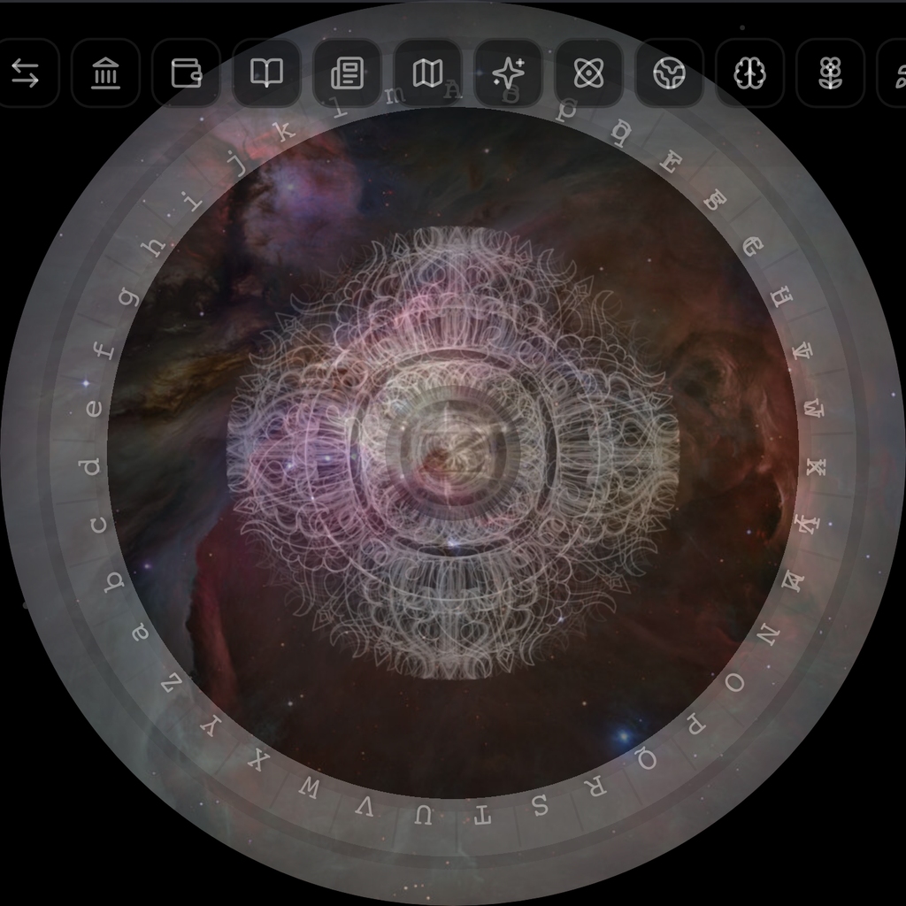

<div align="center">

<!-- Hero banner — Stargate OG image -->


<!-- Animated Z logo -->


<!-- Title -->
<h1>ZION</h1>

<h3>Terra Nova — 100 let evoluZionu</h3>

<p><em>Multichain Dharma ekosystém zabezpečený proof-of-work konsenzem.</em></p>

<!-- Badges -->
<p>


</p>

<!-- Links -->
<p>

[🌐 Web](https://www.zionterranova.com)
&nbsp;·&nbsp;
[📖 Whitepaper](../../docs/whitepaper.md)
&nbsp;·&nbsp;
[🎮 Oasis](../../V3/L4/oasis/README.md)
&nbsp;·&nbsp;
[⚡ CLI](../../V3/cli/README.md)
&nbsp;·&nbsp;
[🔒 Security](../../SECURITY.md)

</p>

</div>

---

<div align="center">

## Čtyři vrstvy

</div>

| Vrstva | Název | Co dělá |
|:-----:|:----:|:--------|
| **L1** | **Core** | PoW blockchain — základ. Vlastní algoritmus `deeksha_lite_v1`, 60s bloky, CPU + GPU těžba. |
| **L2** | **DeFi** | Staking, farming, governance, cross-chain bridge na 6 EVM chainů (Base, Arbitrum, BSC, Polygon, Optimism, Avalanche). |
| **L3** | **WARP** | Cross-chain router — 21 registrovaných chain adaptérů, atomic swapy, Hiran AI inference vrstva. |
| **L4** | **Oasis** | Duchovní MMORPG s těžbou vědomí — 199 avatarů, 245 úkolů, Golden Egg (108 clue), 1B ZION prize pool. |

<div align="center">

*ZION je vícevrstvý blockchain: L1 PoW jádro, L2 DeFi a cross-chain bridge, L3 WARP a Hiran AI a L4 Oasis — duchovní MMORPG s těžbou vědomí.*

*Tento repozitář obsahuje kód hlavní sítě v3. Aktuálně je v **Mainnet Beta**: živá, produkuje bloky a těžba je na vlastní nebezpečí.*

</div>

---

<div align="center">

## Vstupte do Oasisu

</div>

| Portál | Cesta |
|:------:|:------|
| ⛏️ **Těžit** | Spusť uzel nebo miner na ZION L1. Začni v [`V3/cli/README.md`](../../V3/cli/README.md). |
| 🎮 **Hrát** | Vstup do světa L4 Oasis — avatary, úkoly, gildy a Golden Egg. Viz [`V3/L4/oasis/README.md`](../../V3/L4/oasis/README.md). |
| 🔨 **Stavět** | Prozkoumej kód, kontrakty, RPC a bridge dokumentaci v [`V3/docs/`](../../V3/docs/) a [`docs/`](../../docs/). |

---

<div align="center">

## Status sítě

</div>

> **⚠️ Mainnet Beta — živá na vlastní nebezpečí**

| Parametr | Hodnota |
|:---------|:--------|
| **Status** | Mainnet Beta |
| **Protokol** | 3.0.4 |
| **Genesis hash** | `4f75a0dfe6dde3b167287d445aa1ade56577b0e9166c641ed288b4c20a79bd6e` |
| **Oficiální launch** | 2026-12-31 |
| **Block time** | ~60 sekund |
| **Těžební algoritmus** | `deeksha_lite_v1` (CPU + GPU) |
| **Celková zásoba** | 144B ZION |
| **Premine** | 14 slotů (founders, treasury, OASIS pool, liquidity) |

Všechny zveřejněné bezpečnostní problémy byly remediovány. Viz [Security](../../SECURITY.md) a [disclosure report](../../docs/security/SECURITY_DISCLOSURE_2026-07.md).

---

## Průvodce začátečníkem — Začni od nuly

> Nikdy jsi nepoužil blockchain? Jsi na správném místě.
> Tento průvodce tě provede vším krok za krokem.
> Potřebuješ jen počítač s Linuxem, macOS nebo Windows (WSL).

### Co je ZION v jednom odstavci?

ZION je **proof-of-work blockchain** (podobně jako Bitcoin, ale s jiným těžebním algoritmem). Má vlastní měnu zvanou **ZION**. Můžeš ZION **těžit** pomocí CPU nebo GPU, **posílat** ho ostatním a časem i **hrát** ve světě Oasis, kde můžeš vydělat další. Síť je živá právě teď — můžeš se připojit ještě dnes.

### Krok 0 — Nainstaluj Rust

ZION je napsaný v Rustu. K sestavení potřebuješ Rust toolchain.

```bash
# Linux / macOS / WSL — nainstaluj Rust přes rustup
curl --proto '=https' --tlsv1.2 -sSf https://sh.rustup.rs | sh
source ~/.cargo/env

# Ověř, že funguje
rustc --version
cargo --version
```

> **Uživatelé Windows:** Nejdřív nainstaluj [WSL2](https://learn.microsoft.com/en-us/windows/wsl/install), pak spusť příkazy výše uvnitř WSL. Nativní Windows buildy jsou plánované, ale zatím nejsou podporované.

### Krok 1 — Stáhni kód

```bash
git clone https://github.com/Zion-TerraNova/v3-Mainnet.git
cd v3-Mainnet/V3
```

### Krok 2 — Sestav vše

Toto zkompiluje uzel, CLI a miner. Poprvé to trvá 5–15 minut.

```bash
# Sestav všechny binárky (uzel + CLI + miner + pool + bridge + DAO + oasis)
cargo build --release

# Hlavní binárky, které budeš používat:
#   target/release/zion          — CLI (peněženka, těžba, ovládání uzlu)
#   target/release/zion-node     — blockchain uzel
#   target/release/zion-miner    — samostatný miner
```

> **Chceš GPU těžbu?** Přidej feature flag:
> - NVIDIA CUDA: `cargo build --release --features gpu-cuda -p zion-miner`
> - AMD / generický OpenCL: `cargo build --release --features gpu-opencl -p zion-miner`
> - Apple Silicon Metal: `cargo build --release --features gpu-metal -p zion-miner`

### Krok 3 — Vytvoř si peněženku

Peněženka drží tvé ZION. Je to JSON soubor chráněný heslem, které si zvolíš.

```bash
# Vygeneruj novou peněženku s 24slovnou obnovovací frází (mnemonic)
# NAPIŠ SI 24 slov na papír a uschovej je — jsou tvou jedinou zálohou!
./target/release/zion wallet new --mnemonic --out my-wallet.json

# Zkontroluj svou peněženkovou adresu (sem chodí těžební odměny)
./target/release/zion wallet info --wallet my-wallet.json
```

> **Co je peněženková adresa?** Je to jako číslo bankovního účtu, ale veřejné — začíná `zion1...` a můžeš ji volně sdílet. 24slovný mnemonic je tvůj **soukromý** klíč — nikdy ho nikomu nesdílej.

### Krok 4 — Spusť uzel (volitelné, ale doporučené)

Uzel se připojuje k ZION síti, stahuje blockchain a ověřuje transakce. Provoz uzlu pomáhá udržovat síť decentralizovanou.

```bash
# Spusť uzel (bude synchronizovat blockchain od ostatních peerů)
./target/release/zion-node

# V jiném terminálu zkontroluj, zda funguje:
./target/release/zion node status
```

> **Co je synchronizace?** Uzel stahuje všechny bloky od genesis bloku až po aktuální tip. Při prvním spuštění to může chvíli trvat. Poté se udržuje aktuální automaticky.

### Krok 5 — Začni těžit

Těžba je způsob, jakým vzniká nový ZION. Tvůj počítač řeší matematické hádanky (proof-of-work), a když najde řešení, vyděláš odměnu za blok.

```bash
# Nejjednodušší cesta — spusť průvodce nastavením
./target/release/zion config init

# Nebo začni těžit přímo se svou peněženkou
./target/release/zion mine start --wallet my-wallet.json

# Zkontroluj stav těžby
./target/release/zion mine status

# Zastav těžbu
./target/release/zion mine stop
```

> **CPU vs GPU:** Těžba s CPU funguje, ale je pomalá. GPU (grafická karta) je mnohem rychlejší. Spusť `zion mine bench --gpu` pro otestování hashrate tvé GPU.
>
> **Pool vs Solo:** Ve výchozím nastavení CLI těží do oficiálního poolu (`pool.zionterranova.com:8444`). V poolovém režimu vyděláš podíl z každého bloku, který pool najde. V solo režimu vyděláš jen když *ty* najdeš blok — což může trvat dlouho. Poolový režim se doporučuje začátečníkům.

### Krok 6 — Zkontroluj zůstatek a posílej ZION

```bash
# Zkontroluj svůj zůstatek
./target/release/zion wallet balance --wallet my-wallet.json

# Pošli ZION někomu
./target/release/zion wallet send --to zion1... --amount 1.5 --wallet my-wallet.json
```

### Interaktivní menu (nejjednodušší pro začátečníky)

Pokud si nechceš pamatovat příkazy, prostě spusť:

```bash
./target/release/zion menu
```

Otevře se interaktivní menu se šipkami — peněženka, uzel, těžba, pool a konfigurace.

### Slovníček — klíčové pojmy jednoduše

| Pojem | Co to znamená |
|------|--------------|
| **Blockchain** | Veřejná účetní kniha všech transakcí, sdílená napříč mnoha počítači |
| **Uzel (node)** | Počítač se spuštěným ZION softwarem, který ukládá a ověřuje blockchain |
| **Těžba (mining)** | Využití výkonu tvého počítače k zabezpečení sítě a vydělávání ZION odměn |
| **Peněženka (wallet)** | Soubor, který drží tvé soukromé klíče — umožňuje ti posílat a přijímat ZION |
| **Mnemonic** | 24 slov, která mohou obnovit tvou peněženku — zapiš si je, nikdy je nesdílej |
| **Blok** | Skupina transakcí přidaná do řetězce zhruba každých 60 sekund |
| **Pool** | Skupina těžařů pracujících společně — odměny se dělí mezi účastníky |
| **ZION** | Měna tohoto blockchainu (ticker: ZION) |
| **Genesis blok** | Úplně první blok — základ celého řetězce |
| **Mainnet Beta** | Živá síť běží, ale může ještě obsahovat chyby — těž na vlastní nebezpečí |

### Potřebuješ pomoc?

- **Plná dokumentace:** [README_FULL.cs.md](./README_FULL.cs.md)
- **CLI reference:** [`V3/cli/README.md`](../../V3/cli/README.md) — všechny příkazy vysvětleny
- **Dokumenty uzlu:** [`V3/docs/`](../../V3/docs/) — architektura, konstanty, runbooky
- **Web:** [zionterranova.com](https://www.zionterranova.com)
- **Issues:** [GitHub Issues](https://github.com/Zion-TerraNova/v3-Mainnet/issues)

---

<div align="center">

## Jazyky

</div>

| | | | | |
|:---:|:---:|:---:|:---:|:---:|
| [English](../../README.md) | **Čeština** | [Español](./README.es.md) | [Français](./README.fr.md) | [Português](./README.pt.md) |

---

<div align="center">

## Plná dokumentace

Kompletní přehled architektury, funkcí, historie a roadmapy najdeš v **[README_FULL.cs.md](./README_FULL.cs.md)**.

</div>

---

<div align="center">


## Licence

Tento projekt je licencován pod [MIT Licencí](../../LICENSE).

---

### Postaveno s péčí, zabezpečeno konsenzem.

[🌐 zionterranova.com](https://www.zionterranova.com) · [🔒 Security](../../SECURITY.md) · [📜 Whitepaper](../../docs/whitepaper.md) · [⚖️ Legal](../../docs/LEGAL_DISCLAIMER.md)

</div>
